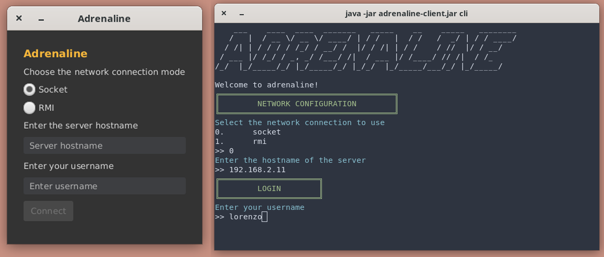
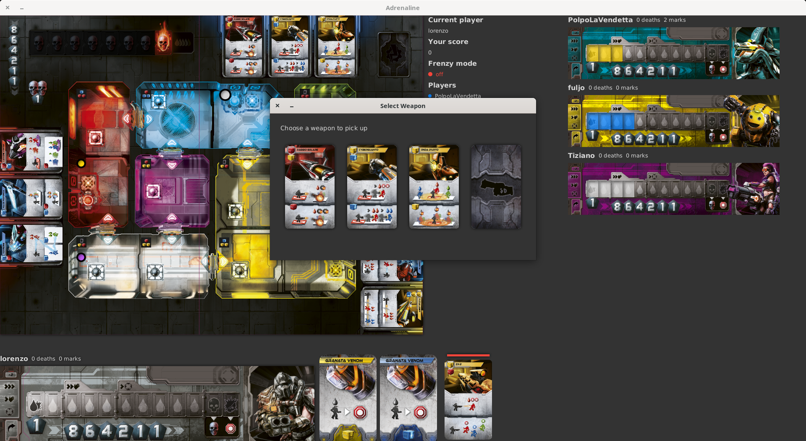
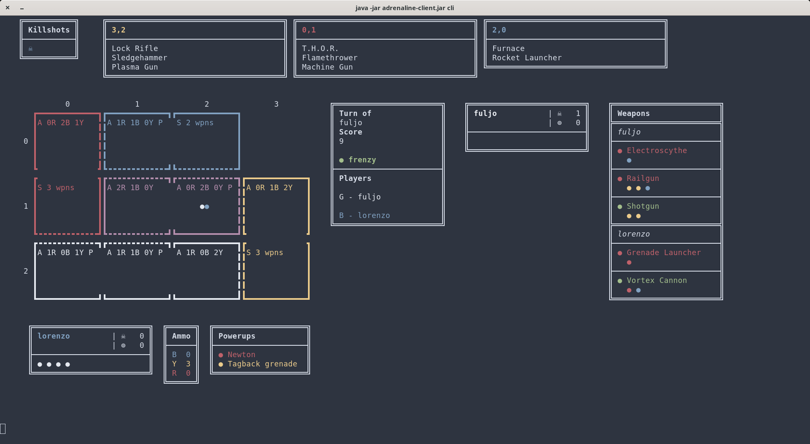
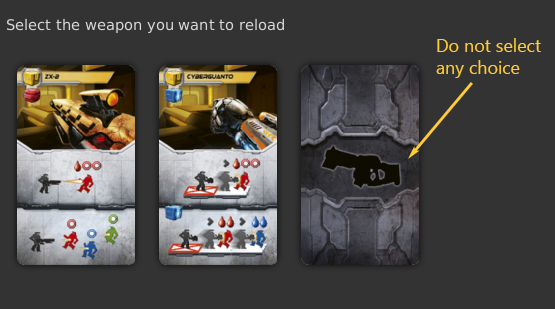

# Adrenaline (Prova finale Ingegneria del Software)
This is a digital adaptation of [Adrenaline](https://czechgames.com/en/adrenaline/), a board game developed by Czech Game Creations and distributed in Italy by Cranio Creations.
The game has been developed in Java as a Software Engineering project at [Politecnico di Milano](https://www.polimi.it).

## Team
<!-- TODO: Remove sensible data before publishing public repo -->
| Name                | Matricola      | Author of                               |
| :------------------ | :------------- | :-------------------------------------- |
| Lorenzo Farinelli   | 866236         | :computer: Client, Model                |
| Tiziano Fucci       | 873622         | :satellite_antenna: Updates, Model      |
| Alessandro Fulgini  | 866390         | :video_game: Controller, Network, Model |

## Features
Base:
- [x] Complete rules
- [x] GUI
- [x] CLI
- [x] TCP connection
- [x] RMI connection

Advanced:
- [x] Multiple simultaneous matches (on the server)
- [ ] Game persistence
- [ ] Terminator
- [ ] Domination mode
- [ ] Turret mode

## System requirements
This software requires Oracle's Java Runtime Environment (including JavaFX)
to be installed and properly configured on the system.

The CLI interface of the client uses ANSI escape codes and Unicode characters,
so make sure that your terminal supports both.
On Windows, this can be achieved by using the Windows Subsystem For Linux (WSL)
terminal with the font
[DejaVu Sans Mono for Powerline](https://github.com/powerline/fonts/tree/master/DejaVuSansMono).
See [this guide by Michele Bertoni](https://github.com/michele-bertoni/W10JavaCLI)
on how to configure it.

## Server
The server can handle multiple matches at a time and both RMI and Socket
clients.\
It is recommended to start it with the command
```
java -Dadrenaline.server.hostname=[hostname] -jar adrenaline-server.jar
```
where `[hostname]` is an address resolvable from the clients who want to connect.
This has the advantages of seeing logs on the console.\
In alternative, the parameter can be set via the `adrenaline.properties` file
(more on this in the [dedicated section](#configuration-parameters));
in this last case, the server can also be started by double-clicking the JAR.

When the server has started, it will wait for login requests by the players.
Once a login request has been accepted, the player will be waiting in the
lobby until there are enough waiting players to start the match.

When the match starts, each player has a maximum amount of time to end his turn
(3 minutes by default).
If the time runs out, he will be suspended and disconnected, but he can
reopen his client, login with the same name and will rejoin the match at the
end of the current turn.
For this reason there cannot be two players with the same name at the same time
in the whole server.

A match may end either because all the players complete their turns
or because at the end of a turn, the number of active players is below
the minimum.
In both cases the scoring is performed and the scores are shown to the
active players.

## Client
To start the client run the following command in a console window:
```
java -jar adrenaline-client.jar
```
and make sure to set the parameter `adrenaline.client.hostname` via
command-line or in the `adrenaline.properties` file,
if you want to connect with RMI (the hostname must be resolvable by the server).
More on this in the section
[configuration parameters](#configuration-parameters).

You can select the user interface with a parameter after the JAR name:
`cli` or `gui`. If no parameter is selected, then GUI is chosen by default.
The client can also be started in GUI mode by double-clicking the JAR.

#### Connection and login
At first you will be asked to insert the server's address, the connection
mode and your username.
Then you will be waiting in a lobby until there are enough players to start
a match.



#### Match screen
Once you have completed the login procedure and the match has stared,
the _match screen_ will be shown.\
It includes: the game board, the weapons in the spawn points, your player board,
your items and other player's boards and weapons.
The match screen will be automatically updated when something changes,
both during your or another player's turn.





#### Selections

During the game you will be asked to make selections.
+ In GUI this is very simple: just click the item you want to select.
+ In CLI each choice has a number: to reply type the number and press
Enter on your keyboard.

Most selections require a choice, but some even accept you to choose nothing.
In this case a special option is presented. For example you can choose to
reload no weapon by selecting the _grey_ card.



## Configuration parameters

The game has various parameters which can be modified by the user.
The parameters can be loaded from a custom file by specifying the following
JVM option `-Dadrenaline.config=path/to/file.properties` where the value
is the path to the properties file (described later).
If such option is not provided, the game will try to load properties
from a default file `adrenaline.properties` in the directory where the
game has been launched.
If this file does not exist, then the default values are used.
The parameters can also be overridden by specifying the corresponding
JVM arguments (`-Dparameter.name=value`) when running the game from command line.

It's important to note that there is no dirty checking for the configuration
parameters, so it's important to check the their correctness before
starting the program.

#### Definitions
These are the parameters:
+ `adrenaline.server.hostname`:
an hostname or IP address for the server, must be resolvable for the clients who
want to connect (used by RMI)
+ `adrenaline.client.hostname`:
an hostname or IP address for the client, must be resolvable for the server to
which the client connects (used by RMI)
+ `adrenaline.rmi.port`:
port of the RMI registry (default 1099)
+ `adrenaline.socket.port`:
port of the server socket (default 3000)
+ `adrenaline.players.min`:
the minumum number of players for a match (default 3).
This must also be less than the maximum number of players, determined by
the colors, which is currently 5, and greater than 0.
If there are less waiting players, a match won't start. If at the end of a turn
the number of active players is less than this, the match ends.
+ `adrenaline.rmi.ping.interval`:
the interval, in seconds, between the ping commands sent from RMI clients to the
server (default 10 s). Note that the server does not ping the clients.
+ `adrenaline.timeout.turn`:
the maximum duration of a player's turn (default 30 s).
If the player does not complete the turn in this time, he will be suspended.
+ `adrenaline.timeout.lobby`:
the timeout after which the lobby starts the match if there are at least
the minimum amount of players connected (default 30 s)
+ `adrenaline.timeout.config`:
the amount of time available for the first player to select the initial match
configuration: board and number of skulls (default 30 s)
If the time runs out, these are selected automatically.
+ `adrenaline.timeout.spawn`:
the amount of time available for players to respawn at the end of the turn
(default 30 s). If they don't respawn, a respawn location is chosen
from the first drawn powerup.
+ `adrenaline.timeout.revenge`:
the amount of time available, after a weapon has been used, for each player
who has a revenge powerup (Tagback grenade) to select whether to use it or
not (default 30 s)

#### Examples
Example run with JVM arguments:
```
java -Dadrenaline.server.hostname=192.168.1.1 -jar adrenaline-server.jar
```

Example configuration file (with default values):
```
adrenaline.rmi.port = 1099
adrenaline.socket.port = 3000
adrenaline.server.hostname = 192.168.1.1
adrenaline.client.hostname = 192.168.1.2
adrenaline.players.min = 3
adrenaline.rmi.ping.interval = 10
adrenaline.timeout.turn = 180
adrenaline.timeout.lobby = 30
adrenaline.timeout.config = 30
adrenaline.timeout.spawn = 30
adrenaline.timeout.revenge = 30
```

#### Logging
Both client and server use the default Java logging library.
A custom logging configuration file can be provided by setting the JVM
parameter `-Dadrenaline.loggerconfig` which must be a path to a valid
logging properties file.
By default the server will log in console with level INFO, while
the client will log to file (`client.log`) with level FINE.

## Copyright
Adrenaline is a trademark of Czech Game Editions and Cranio Creations.
